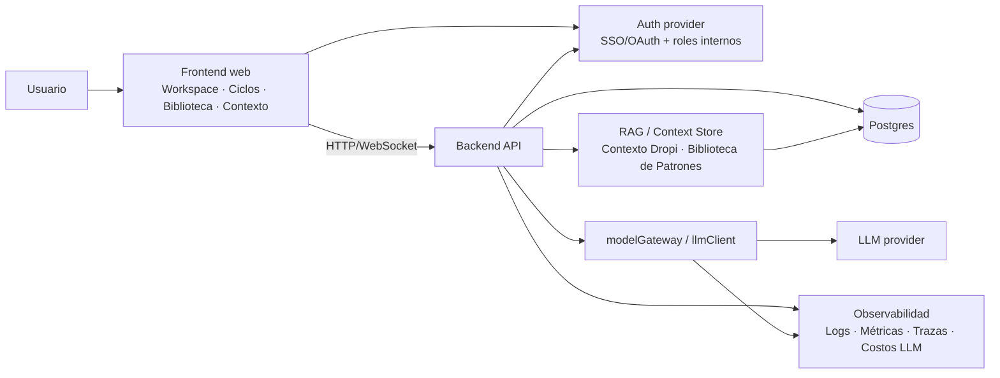
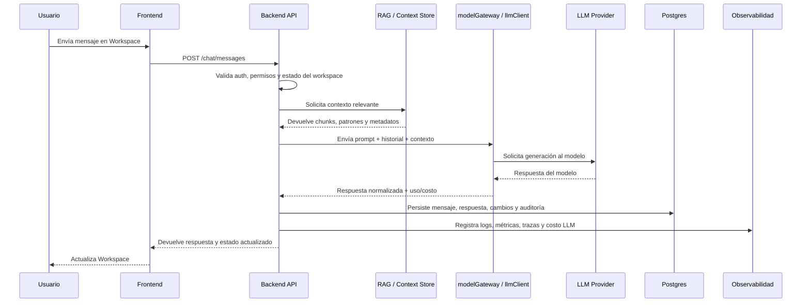

# Arquitectura objetivo

Este documento describe la arquitectura objetivo para una plataforma de Product Back Office orientada a trabajo asistido por IA. La solución separa responsabilidades entre frontend, backend, almacenamiento, proveedor LLM, módulos RAG/contextuales, autenticación, despliegue y observabilidad.

## Diagrama de alto nivel



## 1. Frontend

Aplicación web enfocada en cuatro superficies principales:

- **Workspace:** área principal de interacción donde el usuario conversa, revisa resultados, edita briefs, observa cambios sugeridos y confirma acciones.
- **Ciclos:** vista para crear, ejecutar y monitorear ciclos de trabajo, incluyendo estados, objetivos, entregables, responsables y resultados.
- **Biblioteca:** repositorio navegable de briefs, experimentos, patrones, plantillas y aprendizajes reutilizables.
- **Contexto:** módulo para administrar Contexto Dropi, fuentes de información, reglas operativas, documentos de negocio y configuración de memoria/RAG.

Responsabilidades principales:

- Renderizar el estado actual del workspace y sus entidades relacionadas.
- Enviar mensajes y acciones del usuario al Backend API.
- Mostrar respuestas generadas por IA, diffs, recomendaciones y estados de ejecución.
- Gestionar sesión, permisos visibles y navegación por rol.
- Actualizar vistas mediante polling, server-sent events o WebSocket cuando existan ejecuciones largas.

## 2. Backend API

El backend concentra reglas de negocio, orquestación de flujos, persistencia y comunicación con servicios externos.

Endpoints objetivo:

- **Chat:** envío de mensajes, streaming de respuestas, historial de conversación y acciones derivadas.
- **Ciclos:** creación, actualización, ejecución, seguimiento y cierre de ciclos.
- **Briefs:** generación, edición, versionado, aprobación y consulta de briefs.
- **Experiments:** definición, hipótesis, métricas, resultados y aprendizajes de experimentos.
- **Patrones:** CRUD de patrones, clasificación, búsqueda, versionado y reutilización.
- **Contexto:** carga, indexación, consulta, invalidación y mantenimiento de fuentes contextuales.

Responsabilidades principales:

- Validar autenticación y autorización.
- Normalizar solicitudes del frontend.
- Armar contexto operativo antes de llamar al LLM.
- Ejecutar herramientas internas y flujos de negocio.
- Persistir mensajes, entidades, estados, resultados y auditoría.
- Exponer contratos estables para el frontend.

## 3. Base de datos

Se recomienda **Postgres** como base de datos principal por su madurez, soporte transaccional, ecosistema, capacidades JSONB y posibilidad de sumar búsqueda/vectorización mediante extensiones cuando sea conveniente.

Entidades iniciales sugeridas:

- `users`, `organizations`, `roles`, `memberships`.
- `workspaces`, `conversations`, `messages`.
- `cycles`, `cycle_runs`, `cycle_steps`.
- `briefs`, `brief_versions`.
- `experiments`, `experiment_results`.
- `patterns`, `pattern_versions`, `pattern_tags`.
- `context_sources`, `context_chunks`, `retrieval_events`.
- `llm_requests`, `llm_costs`, `audit_events`.

Postgres debe ser la fuente de verdad para el estado de negocio. El índice vectorial o motor RAG puede vivir como extensión de Postgres, servicio especializado o módulo separado con sincronización controlada.

## 4. LLM provider

El acceso a modelos debe encapsularse detrás de una capa interna llamada **`modelGateway`** o **`llmClient`**.

Responsabilidades de esta capa:

- Unificar llamadas a proveedores LLM.
- Centralizar selección de modelo, temperatura, límites de tokens y políticas de retry.
- Aplicar guardrails, plantillas de prompts y contratos de salida estructurada.
- Registrar uso, latencia, tokens, costos y errores por solicitud.
- Permitir cambio de proveedor o modelo sin afectar el resto del backend.

Interfaz conceptual:

```ts
llmClient.generate({
  model: 'selected-model',
  systemPrompt,
  messages,
  context,
  responseSchema,
  metadata,
})
```

## 5. RAG / context store

El RAG y almacenamiento contextual deben ser un módulo separado del backend de negocio, aunque puedan compartir infraestructura.

Ámbitos principales:

- **Contexto Dropi:** información operativa, reglas de negocio, histórico relevante, definiciones internas, restricciones y datos de producto.
- **Biblioteca de Patrones:** patrones reutilizables, casos anteriores, heurísticas, plantillas y aprendizajes documentados.

Responsabilidades:

- Ingestar documentos, notas, patrones y fuentes estructuradas.
- Dividir contenido en chunks con metadatos útiles.
- Generar embeddings cuando aplique.
- Resolver consultas semánticas e híbridas.
- Devolver contexto trazable al backend: fuente, relevancia, fecha, versión y permisos.
- Mantener separación entre contexto global, contexto por organización y contexto por workspace.

## 6. Auth

La arquitectura debe usar un proveedor de autenticación elegido, por ejemplo Auth0, Clerk, Supabase Auth, Cognito o un proveedor corporativo compatible con OAuth/OIDC.

Roles internos sugeridos:

- **Admin:** administra organización, usuarios, permisos, configuración y fuentes globales.
- **Owner:** responsable del workspace y decisiones de aprobación.
- **Editor:** crea y modifica briefs, ciclos, experimentos, contexto y patrones.
- **Viewer:** consulta información sin modificar recursos críticos.
- **Service:** rol técnico para jobs, integraciones y procesos automatizados.

El backend no debe depender únicamente de claims externos: debe mapear la identidad autenticada a roles y permisos internos persistidos en la base de datos.

## 7. Deploy

Despliegue objetivo por componentes:

- **Frontend:** hosting estático o plataforma web administrada, con variables públicas estrictamente necesarias.
- **Backend:** servicio API containerizado o serverless, con acceso privado a base de datos, secretos y proveedor LLM.
- **DB:** Postgres administrado con backups automáticos, migraciones versionadas, monitoreo y políticas de retención.
- **RAG/context store:** servicio separado o módulo desplegado junto al backend, con almacenamiento de índices y jobs de ingestión.
- **Jobs/Workers:** procesos asíncronos para indexación, ejecuciones largas, evaluaciones, resúmenes y mantenimiento.

Variables de entorno mínimas:

- `DATABASE_URL`
- `AUTH_PROVIDER_ISSUER`
- `AUTH_PROVIDER_AUDIENCE`
- `AUTH_PROVIDER_CLIENT_ID`
- `LLM_PROVIDER`
- `LLM_API_KEY`
- `LLM_DEFAULT_MODEL`
- `RAG_STORE_URL` o configuración equivalente
- `APP_ENV`
- `LOG_LEVEL`
- `OTEL_EXPORTER_OTLP_ENDPOINT`

## 8. Observabilidad

La observabilidad debe diseñarse desde el inicio para entender comportamiento del sistema, calidad de respuestas y costo operativo.

Capas recomendadas:

- **Logs:** eventos estructurados con `requestId`, `userId`, `workspaceId`, entidad afectada y severidad.
- **Métricas:** latencia, tasa de errores, throughput, duración de ciclos, volumen de mensajes y tiempos de recuperación RAG.
- **Trazas:** seguimiento distribuido frontend → backend → RAG → LLM → DB.
- **Costos LLM:** tokens de entrada/salida, modelo usado, proveedor, costo estimado, costo por workspace, costo por ciclo y alertas de gasto.

Eventos clave a instrumentar:

- Mensaje enviado.
- Contexto recuperado.
- Llamada LLM iniciada/finalizada.
- Respuesta persistida.
- Brief/ciclo/experimento/patrón modificado.
- Error de autenticación/autorización.
- Fallos de indexación o recuperación RAG.

## Flujo principal



Descripción paso a paso:

1. El usuario envía un mensaje desde el Workspace.
2. El frontend llama al endpoint de chat del backend.
3. El backend valida sesión, rol interno y permisos sobre el workspace.
4. El backend arma el contexto consultando historial, entidades de negocio y el módulo RAG/context store.
5. El backend invoca `modelGateway` o `llmClient` con prompt, mensajes, contexto y contrato esperado.
6. El proveedor LLM responde al gateway.
7. El backend normaliza la respuesta, detecta acciones, genera cambios de estado si corresponde y persiste todo en Postgres.
8. El backend registra logs, métricas, trazas y costos asociados a la interacción.
9. El frontend recibe la respuesta, refresca el workspace y muestra los cambios al usuario.

## Principios de diseño

- Separar UI, reglas de negocio, persistencia, contexto/RAG y proveedor LLM.
- Mantener Postgres como fuente de verdad transaccional.
- Evitar acoplar el producto a un único proveedor LLM.
- Hacer trazable toda respuesta generada por IA: fuentes, prompts, modelo, versión y costo.
- Diseñar permisos por organización, workspace y recurso.
- Priorizar contratos API estables y versionables.
